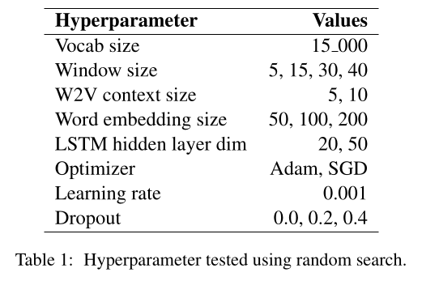

# NLP First Homework: Named Entity Recognition

NLP Course - July 2022

## Introduction
Name Entity Recognition (NER) is a sequence labelling task that aims at locating and classifying named entities mentioned in a corpus into categories. For this tasks the following labels are considered: PER (Person), CORP (Corporation), LOC (Location), PROD (Product), GRP (Group), CW (Creative Work), O (for no named entity). For each label the BIO format is used:  a label has the prefix B- if it is the beginning of some consecutive named entities, and has the prefix I- otherwise. Therefore the labels are actually 13: B-PER, B-LOC, B-GRP, B-CORP, B-PROD, B-CW, I-PER, I-LOC, I-GRP, I-CORP, I-PROD, I-CW and O. 

## Preprocessing and vocabulary
The training data is really unbalenced, as shown in Figure 1. Removing the 'O' labels, the training set is almost balanced (Figure 2).
The training set was used to build a vocabulary consisting of the most 15000 frequent distinct tokens, using the string 'UNK' to encode OutOfVocabulary words, and the string 'pad' for padding (used later to build training and validation sets). In the training set there are about 19 thousands of distinct token, so a vocab\_size of 15 thousands elements allows a good representationd for the OOV words. 
The two datasets are also preprocessed before being used for the training: for each sentence in the dataset, a rolling window of  length 30 is used to create subsequences of the same size shifting the window of a single token each time and applying padding when needed. The sequences of tokens, together with the related label sequences, are encoded using the previous vocabulary and a label dictionary. The label dictionary also contains a label for the padding. For all the experiments, a batch size of 100 sequences was employed for both training and validation datasets.

## Models
The base model structure used for this task is the LSTM model. This is a particular model of recurrent neural network that is able to work with long sequences of data and to learn long dependencies among them. Starting from LSTM, the model can be extended: Bi-LSTM and Bi-LSTM CRF have also been taken into account for this task. In the next sections, the best hyperparameters are reported, while table \ref{hyp} reports all hyperparameters considered for tuning these models.

## LSTM
As anticipated, the base structure model for this task is a LSTM neural network with a single hidden layer of size 50 that takes as input the word embedding vectors of a sequence of tokens and outputs for each token a vector containing a score for each label. The best optimizer for this task was the Adam optimizer with a learning rate of 0.001, as the SGD optimizer only led to worse performances slowing down the tets. The LSTM is preceded by a word embedding layer of size 200 with a random initialization and a widow size of 30 tokens to produce the subsequences for the training and validation datasets.  This model only reached a F1 score of 0.15.  
Initially, only a window size of lengh 5 was considered, and this led to much lower F1 scores. Increasing the window size improved the performances, showing that LSTM are able to identify and exploit long-term dependencies and are not negatively affected by longer length of the sequences.

## Word2Vec word-embedding
In order to increase the performances of the previous model, SkipGram algorithm was used to train a word embedding layer and so to avoid a random initialization of the weights. For this task Skipgram Word2Vec used a context size of length 5 to match tokens belonging to the same context. This led to a slight improvements on the performances, as the best F1 score reached 0.17. 

## Bi-LSTM and dropout layer
A Bi-LSTM neural network is a model consisting of two LSTM, one reading the input in the forward direction, the other in the opposite direction. This allows the model to consider also the "future" context of a token in order to predict its label. Such a model can be further improved by enabling a dropout layer. It was indeed shown [^1] that a dropout layer can help decreasing the risk of overfitting so a first dropout layer was inserted after the embedding layer, and a second one after the Bi-LSTM layers. The best value for the dropout layers was 0.2 for a F1 score of 0.23 . 

## Bi-LSTM CRF
The most complex model tested for this task was the Bi-LSTM CRF model [^2]: a Bi-LSTM neural network followed by a conditional random field layer, including the two dropout layers previoulsy cited. The output computed by the Bi-LSTM is represented by a sequence of vectors that contain the scores assigned to the labels. These vectors become the inputs for a CRF layer that select the "best" label taking into account a transition matrix $A$ where the element $A(i,j)$ represents the score of transitioning from label $i$ to label $j$.\newline 
This last model together with the Word2Vec word embedding initialization and the two dropout layers of value 0.2 reached a F1 score of 0.55.

## Conclusion
What really improved the performances in the various model is the higher lenght of the window size for creating the sequences and the introduction of the CRF layer. 
The model could have been further improved by employing a char embedding  together with the skipgram word embedding. Training data could have been increased as named identity have low frequencies making the dataset really unbalanced. As a consequence, in order for the model to correctly classify named entities, much more training data may be necessary.

 
 
 

------
[^1]: Nitish Srivastava, Geoffrey E. Hinton, Alex Krizhevsky, Ilya Sutskever, and Ruslan Salakhutdinov. 2014. Dropout: A simple way to prevent neural networks from overfitting. Journal of Machine Learning Research, 15(1): 1929 - 1958.

[^2]: Guillaume Lample, Miguel Ballesteros, Sandeep Sub-ramanian, Kazuya Kawakami, and Chris Dyer. 2016.
Neural architectures for named entity recognition.
In Proceedings of the 2016 Conference of the North
American Chapter of the Association for Computa-
tional Linguistics: Human Language Technologies,
pages 260 - 270, San Diego, California. Association
for Computational Linguistics.

